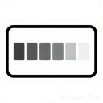
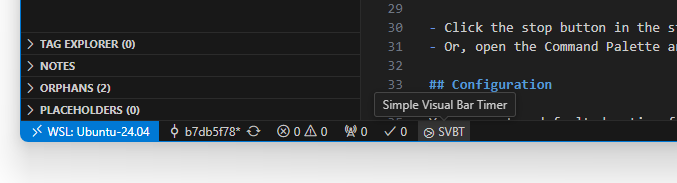
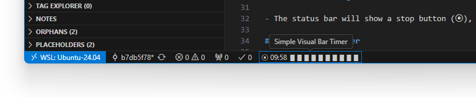
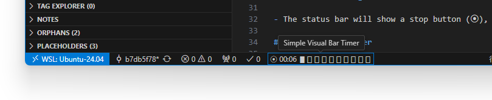

# SVBT - Simple Visual Bar Timer -



A simple visual bar timer in the VS Code status bar.

## Features

- **Status Bar Timer**: A timer that runs in the status bar.
- **Custom Duration**: Set a timer for any duration from 1 to 60 minutes.
- **Visual Feedback**: A progress bar and a `MM:SS` countdown provide clear visual feedback.
- **Simple Controls**: Start and stop the timer directly from the status bar.
- **Configurable**: Set a default timer duration in the settings.

## How to Use

### 1. Start the Timer

- Click the **▶ Start Timer** button in the status bar(Immediately after startup, **SVBT** ).
- Or, open the Command Palette (`Ctrl+Shift+P` or `Cmd+Shift+P`) and run the **Start Timer** command.



### 2. Set Duration

- An input box will appear. Enter the desired duration in minutes (1-60).


### 3. Monitor Progress

- The status bar will show a stop button (⦿), the remaining time, and a progress bar.




### 4. Stop the Timer

- Click the stop button in the status bar.
- Or, open the Command Palette and run the **Stop Timer** command.

## Configuration

You can customize the timer by changing the following settings in your VS Code `settings.json` file:

- `simpleVisualBarTimer.defaultDuration`: The default timer duration in minutes.
  - Default: `25`
- `simpleVisualBarTimer.remainingChar`: The character used to represent the remaining time in the progress bar.
  - Default: `▮`
- `simpleVisualBarTimer.elapsedChar`: The character used to represent the elapsed time in the progress bar.
  - Default: `▯`
- `simpleVisualBarTimer.barCount`: The number of bars to display in the timer.
  - Default: `10`
  - Minimum: `5`
  - Maximum: `30`

### Example Configuration

```json
{
  "simpleVisualBarTimer.defaultDuration": 10,
  "simpleVisualBarTimer.remainingChar": "⭓",
  "simpleVisualBarTimer.elapsedChar": "⭔",
  "simpleVisualBarTimer.barCount": 20
}
```

## Note

- [Status Bar | Visual Studio Code Extension API](https://code.visualstudio.com/api/ux-guidelines/status-bar)

## Contributing

Feel free to open an issue or submit a pull request.

## License

MIT
