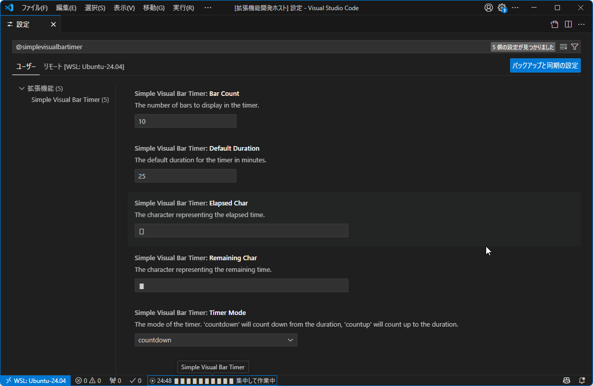
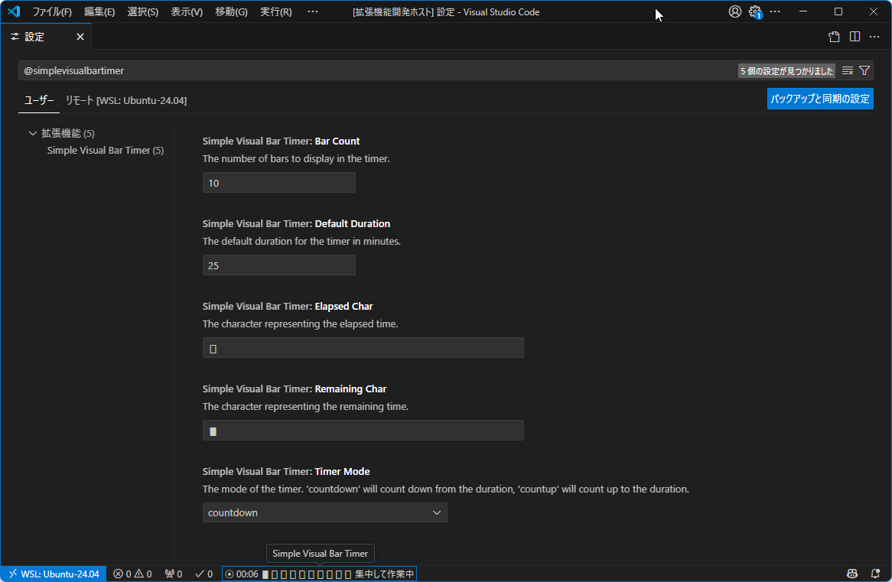

# SVBT - Simple Visual Bar Timer -


A simple visual bar timer in the VS Code status bar.

## Features

- **Status Bar Timer**: A timer that runs in the status bar.
- **Custom Duration**: Set a timer for any duration from 1 to 200 minutes.
- **Task Name**: Record the task name along with the timer.
- **Visual Feedback**: A progress bar and a `MM:SS` countdown provide clear visual feedback.
- **Simple Controls**: Start and stop the timer directly from the status bar.
- **Configurable**: Set a default timer duration in the settings.

## How to Use

### 1. Start the Timer

- Click the **⧁ Start Timer** button in the status bar(Immediately after startup, **⧁ SVBT** ).
- Or, open the Command Palette (`Ctrl+Shift+P` or `Cmd+Shift+P`) and run the **Start Timer** command.

### 2. Set Duration and Task Name

- An input box will appear. Enter the desired duration in minutes (1-200).
- Next, an input box for the task name will appear. If left blank, it will be set as "集中して作業中".


### 3. Monitor Progress

- The status bar will show a stop button (⦿), the remaining time, a progress bar, and the task name.

### 4. Stop the Timer

- Click the stop button in the status bar.
- Or, open the Command Palette and run the **Stop Timer** command.




## Configuration

You can customize the timer by changing the following settings in your VS Code `settings.json` file:

- `simpleVisualBarTimer.defaultDuration`: The default timer duration in minutes.
  - Default: `25`
- `simpleVisualBarTimer.remainingChar`: The character used to represent the remaining time in the progress bar.
  - Default: `▮`
- `simpleVisualBarTimer.elapsedChar`: The character used to represent the elapsed time in the progress bar.
  - Default: `▯`
- `simpleVisualBarTimer.barCount`: The number of bars to display in the timer.
  - Default: `10`
  - Minimum: `5`
  - Maximum: `30`
- `simpleVisualBarTimer.timerMode`: The mode of the timer. `countdown` will count down from the duration, `countup` will count up to the duration.
  - Default: `countdown`


### Example Configuration

```json
{
  "simpleVisualBarTimer.defaultDuration": 10,
  "simpleVisualBarTimer.remainingChar": "⭓",
  "simpleVisualBarTimer.elapsedChar": "⭔",
  "simpleVisualBarTimer.barCount": 20,
  "simpleVisualBarTimer.timerMode": "countdown"
}
```

### Example Keyboard shortcut

- Type to `, v` start SVBT(oem_102 is `,`)
- Why use `v` ? because I already using both `s` and `t`. :-)

```json:keybingings.json
[
  {
    // Start SVBT
    "key": "oem_102 v",
    "command": "simple-visual-bar-timer.startTimer"
  }
]
```

## Note

- [Status Bar | Visual Studio Code Extension API](https://code.visualstudio.com/api/ux-guidelines/status-bar)

## Contributing

Feel free to open an issue or submit a pull request.

## License

MIT
